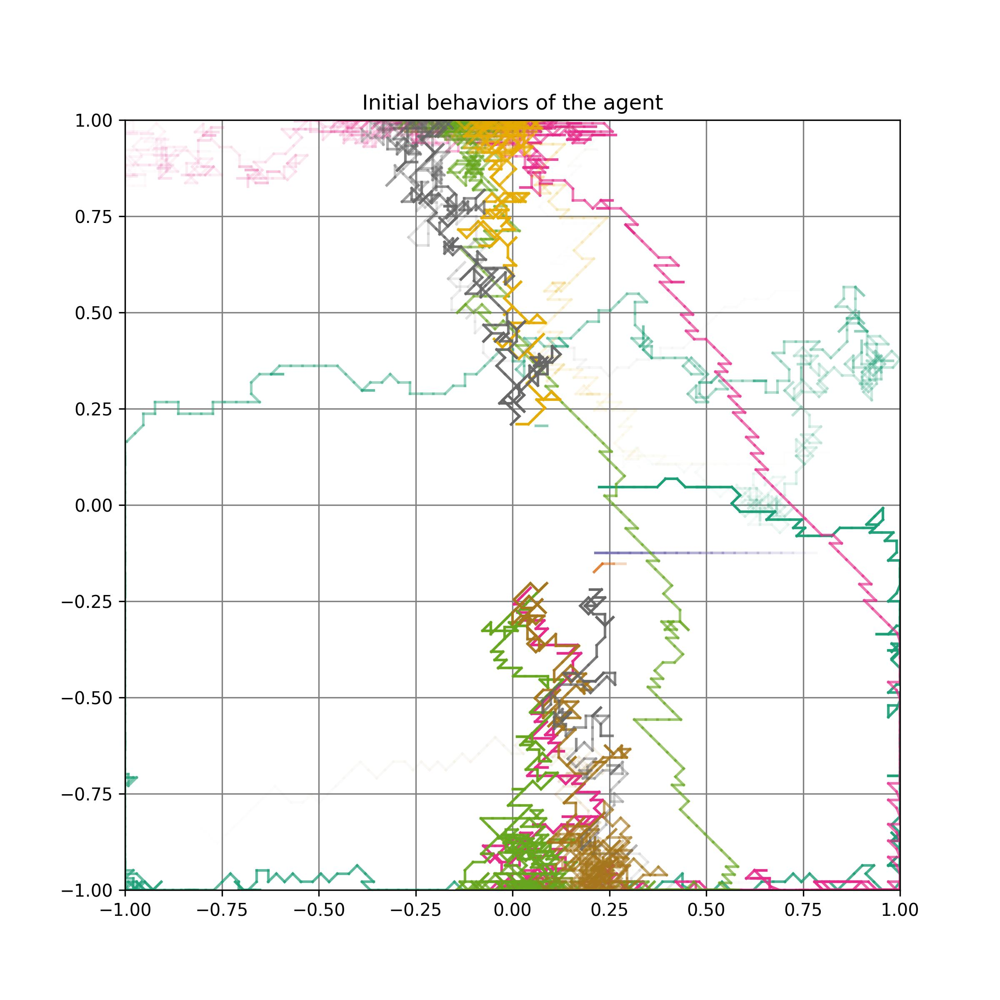
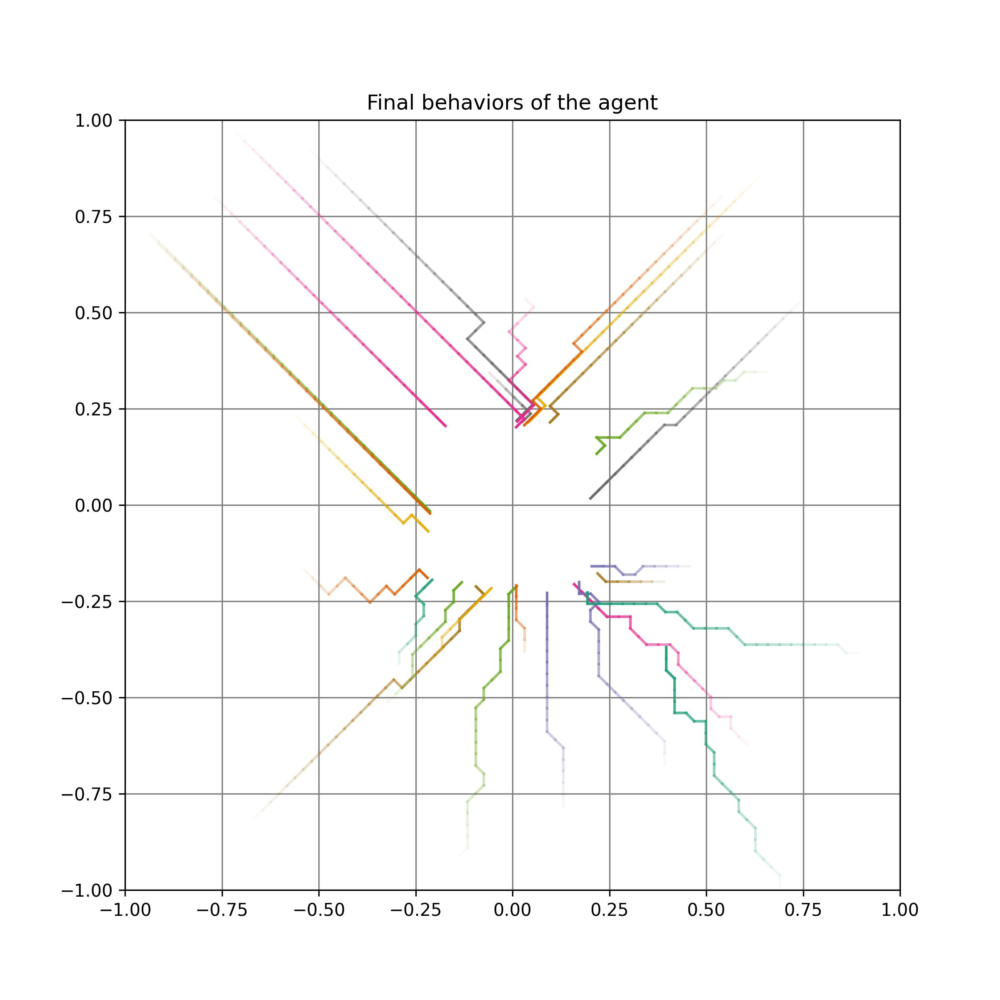
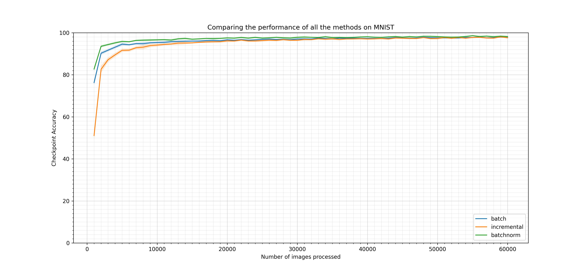

# Policy Gradient Methods
This repository contains the policy gradient algorithms from bandit policy gradient to 
PPO and REINFORCE. Each algorithm is explained in the following section.

### Gradient Bandit
The policy chooses actions from a normal distribution ($A \sim \mathcal{N}(\mu, \sigma^2) $) as follows:
$$\pi_\theta(A) = \frac{1}{\sqrt{2\pi\sigma^2}}\exp\left(-\frac{1}{2\sigma^2}(A - \mu)^2\right)$$
where the policy is parametrized by $\theta = [\mu, \sigma^2]^\top$ and $\mu \in \mathbb{R}$ and 
$\sigma^2 \in \mathbb{R}^+$. 

The environment provides a reward sampled from another normal distribution 
$R\sim\mathcal{N}\left(-(A - a^\*)^2, 1\right)$ where $a^\*$ is the value of the optimal arm.

### Actor Critic
In this task, the agent at each episode appears and moves around in a bounded 2D arena. The
agent’s actions change its position and the goal is to reach a region near the center of the space
as soon as possible, at which point the episode terminates.
An episodic task is implemented by defining the following components:
- **Environmental state:** A state is a vector in $[-1, +1]^2$, which corresponds to the position
of the agent in the 2D arena. It follows that the arena is the space $[-1, +1]^2$.
- **Observation:** Here the agent sees fully the environmental state, making both the same.
- **Action:** The agent can take one of nine actions: LEFT, LEFT-UP, UP, RIGHT-UP, RIGHT,
RIGHT-DOWN, DOWN, LEFT-DOWN, and STAY.
- **Transition:** Upon taking one of the above nine actions, the position of the agent, that is,
the environmental state, changes by the following amounts, respectively: $[-B, 0]$, $[-B, +B]/\sqrt{2}$, 
$[0, +B]$, $[+B, +B]/\sqrt{2}$, $[+B, 0]$, $[+B, -B]/\sqrt{2}$, $[0, -B]$, $[-B, -B]/\sqrt{2}$, $[0, 0]$. 
One exception is when the position resulting from the action goes outside the arena, in which case the
agent is kept within the arena by clipping the two components at the boundary. Here, $B = 0.03$.
Therefore, in most cases, $S’ = S + f(A)$, where $f$ is given by the above increments.
- **Termination:** The episode terminates when the position after an action is in $[-0.2, +0.2]^2$.
- **Reward:** The reward is $-0.01$ every time step.
- **Start state distribution:** The start state is chosen uniformly randomly from $[-1, +1]^2$.
- **Discounting:** This task is undiscounted.

The agent is the same as the one-step Actor-Critic from Section 13.5 of the [Reinforcement Learning book (Sutton &
Barto 2020)](http://incompleteideas.net/book/RLbook2020.pdf). 

The trajectories the agent took during the first 10 episodes of training is depicted in the figure on the left. Note that a 
trajectory is represented by a curve of a particular color (some share the same
color), and the earlier part of each trajectory has a lighter shade of that color.
The trajectories of the agent during the final behaviors represented in the figure on the right.



### Online Supervised Learning
In this section, an online learning algorithm is used to train on MNIST task. Samples arrive one at a time and 
evaluation happens right away. Here, we have implemented three types of algorithms for online learning:
- **Incremental:** In this method, the learning update happens every time-step in a fully incremental manner with no 
samples stored.
- **Batch Learning:** In this method, we have a memory to store samples and perform mini-batch updates. Each sample arrives
will be stored into the memory. Then a mini-batch of samples would be selected randomly from the memory to perform the update.
The general form of the algorithm is as follows:
```
batch_learning(buffer, theta, E, N, M):  
    For epoch from 1 to E:
        Shuffle samples in the buffer
        Slice buffer into N mini-batches
        
        For mini-batch from 1 to M:  # M <= N
            Update theta using the mini-batch
    Return theta
```
- **Batch Learning with Normalization:** In this method, we add batch normalization layers to the neural network, which
improves the performance.

The learning curves of these three methods are depicted in the following figure.



### Online Policy Learning
In this section, we implemented batch Reinforce and PPO. The batch Reinforce algorithm is as follows:

```
{.algorithm}
% This quicksort algorithm is extracted from Chapter 7, Introduction to Algorithms (3rd edition)
\begin{algorithm}
\caption{Quicksort}
\begin{algorithmic}
\PROCEDURE{Quicksort}{$A, p, r$}
    \IF{$p < r$} 
        \STATE $q = $ \CALL{Partition}{$A, p, r$}
        \STATE \CALL{Quicksort}{$A, p, q - 1$}
        \STATE \CALL{Quicksort}{$A, q + 1, r$}
    \ENDIF
\ENDPROCEDURE
\PROCEDURE{Partition}{$A, p, r$}
    \STATE $x = A[r]$
    \STATE $i = p - 1$
    \FOR{$j = p$ \TO $r - 1$}
        \IF{$A[j] < x$}
            \STATE $i = i + 1$
            \STATE exchange
            $A[i]$ with $A[j]$
        \ENDIF
        \STATE exchange $A[i]$ with $A[r]$
    \ENDFOR
\ENDPROCEDURE
\end{algorithmic}
\end{algorithm}
```


